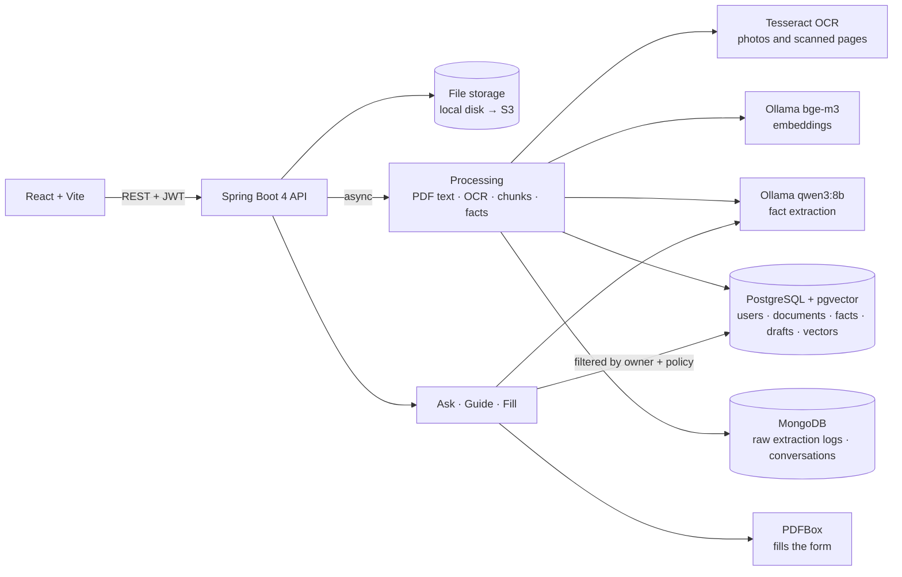

# ClaimPilot

**Ask your insurance policy, see what a claim needs, and get the claim form filled in from your own documents.**

Upload your group benefits booklet and ask questions in English, French or Chinese: every answer
comes from the policy and cites the page. If the policy is silent, ClaimPilot prepares the insurer's
number, your policy numbers and a script for the call. When you need to claim, it lists the
deadlines and documents *your* policy requires, then pre-fills the claim form from your policies,
your receipt and your profile, showing where every value came from. You check each field, sign and
submit the form yourself.

<!-- Screenshot: add docs/screenshot.png showing the claim review page. -->

## Why

- Half of Canadians do not know what insurance coverage they have, and 40–60% of workplace health
  benefits go unused each year, mostly because employees do not know what is covered.
- Clinics can bill the first plan directly, but a claim on a second plan (a spouse's group plan)
  usually has to be filled in and sent by hand.
- Complaints to the General Insurance OmbudService reached a record in 2024–2025, most about claims
  and how to read the policy.

Plain "upload a document and chat with it" is easy to copy. ClaimPilot's value is the whole loop
(*is it covered → how do I claim → the form is ready*) and the engineering around the AI that makes
the result trustworthy.

## What it does

### 1. Ask your policy
- Answers in the language of the question, even when the policy is in another language.
- Every fact cites the policy page; the Sources panel shows the clause text.
- Three outcomes:
  - **Answered**: the clauses answer the question.
  - **Unclear**: the relevant clauses are shown with a note to confirm with the insurer.
  - **Not in the policy**: a call kit with the insurer's phone and hours, your group policy and
    certificate numbers, and a script to read (in English, translated if you asked in French or
    Chinese). When nothing relevant is found, no model call is made at all.
- Follow-up questions keep the context of the conversation (stored in MongoDB).

### 2. Claim guide
For a claim type and a policy: deadlines, documents to include (a checklist), how to submit,
what the plan pays, and whether approval or a referral is needed first. Every item cites the
clause it came from; items the model cannot tie to a clause are dropped.

### 3. Pre-filled claim form
The demo form is a fictional second-plan ("supplementary") health claim:

| Form section | Filled from |
|---|---|
| Plan member, policy and certificate numbers, employer | The plan being claimed on (the spouse's policy) |
| Other plan: insurer, policy and certificate numbers | The plan that paid first (your own policy) |
| Provider, date, service, amount charged, amount paid by the other plan | The receipt (PDF or photo) |
| Patient name, date of birth, address | Your profile |
| Relationship to the plan member | Chosen when you start the claim |
| Amount claimed | Calculated: charged minus paid by the other plan |
| Signature, declaration, date signed, bank details | **Never filled.** Left for you |

Each field shows its source (document, page and quote). Values the code could not confirm in the
document are flagged *check*. The filled PDF can only be downloaded once every field has been
checked, and it stays editable.

## How the AI is kept honest

- **The model reads, the code checks.** When a document is uploaded, the model extracts key facts
  (policy number, phone, amounts, dates) together with the exact quote each one came from. Code then
  looks for that quote in the document text, finds its page, and confirms the value is inside the
  quote, parsing dates and amounts in English and French formats. Anything it cannot confirm is
  marked unverified instead of being trusted.
- **The model maps, the code fills.** PDF field names are often meaningless (`txtField_07`). The model
  reads each field's label once and maps it to a known data item; the mapping is stored per form
  version (SHA-256) and reused, so later claims need no model call. Apache PDFBox writes the values,
  which is deterministic and unit-tested.
- **Hard rules in code, not in the prompt.** Signature, declaration and consent fields are forced to
  stay blank even if the model maps them to a value (a test checks exactly that). An "answered"
  reply that cites nothing is downgraded to "unclear". Guide items without a valid clause are dropped.
- **Data isolation.** Every chunk in pgvector carries its owner's id, and every search is filtered
  by the signed-in user and the chosen policy, so another person's policy text never reaches the model.
- **Prompt-injection guard.** Document text is passed as data, with instructions to ignore any
  instructions inside it.

## Architecture



| Layer | Technology |
|---|---|
| Backend | Java 21, Spring Boot 4.1, Spring AI 2.0, Spring Security (JWT), Spring Data JPA and MongoDB, Flyway, virtual threads |
| AI | Ollama locally: qwen3:8b (chat, extraction, mapping), bge-m3 (multilingual embeddings). Amazon Bedrock planned |
| Documents | Apache PDFBox (read pages, fill forms), Tesseract OCR (photos, scanned PDF pages), Apache Tika (Word) |
| Data | PostgreSQL 17 + pgvector (HNSW, cosine); MongoDB 7 for raw model replies and conversations |
| Frontend | React 19, TypeScript, Vite |
| Testing | JUnit 5, AssertJ, MockMvc, Testcontainers (pgvector, MongoDB) |

## Getting started

### Prerequisites

- Java 21 (Maven is not needed: the backend ships with the Maven Wrapper, `./mvnw`)
- Node.js 20 or later
- Docker Desktop
- [Ollama](https://ollama.com) installed natively (it uses the Apple GPU on macOS)
- Tesseract for photos and scanned PDFs: `brew install tesseract` (add `tesseract-lang` for French
  scans, then set `claimpilot.ocr.languages: eng+fra`)

### Run

```bash
ollama pull qwen3:8b
ollama pull bge-m3

docker compose up -d            # PostgreSQL and MongoDB

cd backend && ./mvnw spring-boot:run
# in another terminal
cd frontend && npm install && npm run dev
```

Open `http://localhost:5173` and sign in as **fiona** (password `demo1234`); her profile is already
filled in. **sam** is an empty account. Outside local development, set
`CLAIMPILOT_SECURITY_JWT_SECRET` to a random string of at least 32 characters.

### Demo (1–2 minutes)

The files are in `sample-docs/`. All companies and people are fictional.

1. **My documents**: upload `cedarview-policy-marc-gagnon.pdf` (Fiona's husband's plan, or the
   `-scanned` version to show OCR) and `harbourline-police-fiona-tremblay-fr.pdf` (Fiona's own plan,
   in French). Each shows the key details read from it, with page numbers.
2. **Ask** about the Cedarview policy:
   - *How much does my plan pay for physiotherapy each year?* → answered, cites page 2.
   - *Are kinesiologist treatments covered?* → the policy only says they "may be considered", so this
     is typically marked unclear and shows the clause.
   - *我的保险报销针灸吗？* (acupuncture is not in the policy) → a reply in Chinese with a call kit and an
     English script.
3. **Claim**: choose *Paramedical care*, claim on Cedarview, paid first by Harbourline. The guide shows
   the 12-month deadline and the documents to send. Upload `physio-receipt-2026-03-05.png`.
4. **Fill in the claim form**: every field shows its source; the amount claimed is $120.00 − $84.00 =
   $36.00. Check each field, then download the PDF. Signature and declaration are blank.

The sample documents are generated by `backend/src/test/java/com/claimpilot/samples/SampleDocuments.java`.

## API

All endpoints except sign-in and sign-up need `Authorization: Bearer <token>`. Every resource is
scoped to the signed-in user; another user's ids return 404.

| Method | Path | Description |
|---|---|---|
| `POST` | `/api/auth/login`, `/api/auth/register` | Sign in or sign up → token and user. |
| `GET` | `/api/auth/me` | The signed-in user. |
| `GET` / `PUT` | `/api/profile` | Name, date of birth, address, phone. |
| `DELETE` | `/api/account` | Delete the account and all its data. |
| `POST` / `GET` | `/api/policies` | Upload (multipart `file`, returns `202`) or list policies with their key facts. |
| `GET` / `DELETE` | `/api/policies/{id}` | One policy; delete it with its chunks and facts. |
| `POST` / `GET` / `DELETE` | `/api/receipts`, `/api/receipts/{id}` | Same for receipts. |
| `POST` | `/api/chat` | `{ question, policyId, conversationId? }` → answer, status, language, citations, call kit. |
| `GET` / `DELETE` | `/api/conversations`, `/api/conversations/{id}` | Conversation history. |
| `GET` | `/api/claims/types` | Supported claim types. |
| `GET` | `/api/claims/guide?policyId=&type=` | Deadlines, documents, submission, coverage, pre-approval. |
| `POST` / `GET` | `/api/claims` | Start a pre-filled claim `{ claimType, policyId, otherPolicyId?, receiptId?, relationship }`, or list claims. |
| `GET` / `DELETE` | `/api/claims/{id}` | One claim with its fields and sources. |
| `PATCH` | `/api/claims/{id}/fields/{key}` | `{ value?, reviewed? }`: correct a value or mark it checked. |
| `GET` | `/api/claims/{id}/pdf` | The filled PDF, once every field is checked. |

Errors follow RFC 9457 (`application/problem+json`).

## Tests

```bash
cd backend
./mvnw test
```

- **Unit tests**: date and amount parsing (English and French), quote verification, extraction
  parsing, language detection, answer status parsing, call script, guide parsing, field mapping
  rules, value assembly, PDF filling.
- **Integration tests** run the whole application over HTTP against real PostgreSQL/pgvector and
  MongoDB in Docker (Testcontainers), with deterministic fake models:
  - `PolicyIntegrationTest`: verified facts, cited answers, unclear and not-in-policy answers,
    French question with an English call script, follow-ups.
  - `ClaimIntegrationTest`: guide with cited items and caching, the complete pre-fill → review →
    download flow, mapping cache, and isolation between users.
  - `ScannedDocumentIntegrationTest`: OCR of a scanned PDF and a receipt photo (skipped without Tesseract).
  - `AccountIntegrationTest`: sign-in, sign-up, profile, and account deletion across both databases.

## Principles

1. ClaimPilot never signs or submits a claim. Declarations have legal weight; the member checks every
   field and signs.
2. It never logs in to insurer websites.
3. It does not collect a social insurance number; bank details are left for the member.
4. It explains what the policy says; it does not give insurance or legal advice.
5. The public repository contains only fictional policies, receipts and forms.

## Roadmap

- [x] **Phase 1**: ask the policy (three outcomes, call kit), claim guide, pre-filled second-plan
  claim form with sources, OCR, accounts and data isolation.
- [ ] **Phase 2**: more claim types and form templates; encrypted file storage.
- [ ] **Phase 3**: event-driven processing. S3 upload triggers AWS Lambda for OCR and extraction,
  Kafka events update the claim draft and notify the user; audit log.
- [ ] **Phase 4**: agent that recognizes the user's intent and chains questions, guide and form filling.
- [ ] **Phase 5**: Redis for mapping and answer caches and rate limiting; accuracy evaluation set;
  AWS deployment with Bedrock.
- [ ] **Later**: coordination-of-benefits rules to decide which plan pays first automatically.
