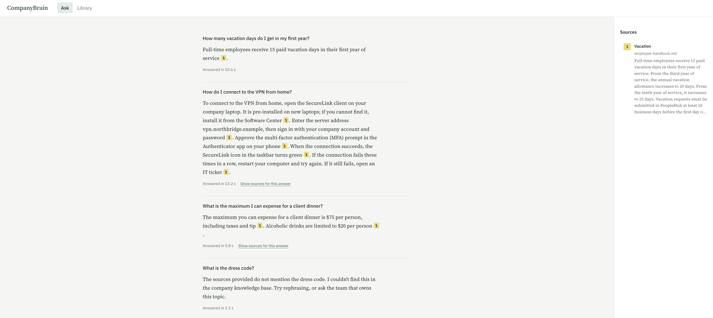
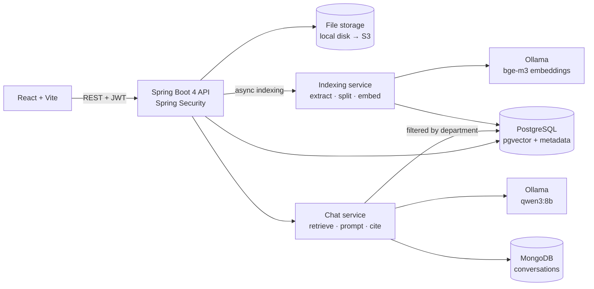

# CompanyBrain

**An AI knowledge assistant for internal company documents.**

Employees ask questions in plain English. CompanyBrain finds the answer in the company's own
documents and replies with a numbered citation for every fact. When the documents do not cover
the question, it says so instead of guessing.

> Example: an employee asks *"How many vacation days do I get in my first year?"*
> CompanyBrain retrieves the passage from the employee handbook, answers in one sentence,
> and links the answer to its source.



## Why this project

Most companies keep policies, guides and procedures in documents that people struggle to find,
and HR, IT and Finance spend hours answering the same questions. General-purpose chatbots do not
know internal policies and may invent them. CompanyBrain uses retrieval-augmented generation (RAG):

- **Semantic retrieval.** Documents are split into chunks and embedded (bge-m3), so a question
  matches the right passage even when it uses different words.
- **Grounded answers.** The model may only use the retrieved passages, must cite them as `[n]`, and
  replies with a fixed "not found" message when the documents do not cover the question.
- **Honest failure.** If no passage passes the similarity threshold, the API answers without calling
  the model at all, which avoids hallucinations and saves compute.
- **Permission-aware retrieval.** A document can be limited to departments. The permission check
  happens inside the vector search, so text a user may not see never reaches the model.

## Features

### Phase 1: grounded answers


- Upload PDF, Word, Markdown and text files; indexing runs in the background (`202 Accepted`).
- Markdown and text files are split at their headings, then into chunks of about 300 tokens,
  so every citation names its section (for example *Vacation* or *Client meals*).
- PDF answers cite page numbers.
- Prompt-injection guard: retrieved text is treated as reference material, never as instructions.
- Deleting a document removes its vectors, its file and its database record.

### Phase 2: users, permissions and conversations

- Sign-in with JWT bearer tokens (Spring Security OAuth2 resource server, HS256) and three roles:
  **Employee** asks questions, **Knowledge manager** also manages documents, **Admin** also manages
  users and departments.
- Each document is visible to the whole company or to selected departments. Every chunk stores an
  `access` list in its vector metadata, and each search adds a filter for the user's department.
  Changing who can see a document updates that metadata with one SQL statement instead of
  re-embedding the file.
- Role and department are read from the database on every request, so an admin's change applies
  immediately, even to tokens that were already issued.
- Conversation history is stored in MongoDB. A follow-up such as *"And from the third year?"* is
  searched both on its own and together with the previous question, and the model receives the
  last few turns as context. Follow-ups cost no extra model call, so they are as fast as a first
  question.

## Architecture



| Layer | Technology |
|---|---|
| Backend | Java 21, Spring Boot 4.1, Spring AI 2.0, Spring Security (JWT), Spring Data JPA and MongoDB, Flyway, virtual threads |
| AI | Ollama (qwen3:8b chat, bge-m3 embeddings) locally; Amazon Bedrock planned |
| Data | PostgreSQL 17 with pgvector (HNSW index, cosine distance) for users, documents and vectors; MongoDB 7 for conversations |
| Frontend | React 19, TypeScript, Vite |
| Infrastructure | Docker Compose |
| Testing | JUnit 5, AssertJ, MockMvc, Testcontainers (pgvector, MongoDB) |

## Getting started

### Prerequisites

- Java 21 (Maven is not needed: the backend ships with the Maven Wrapper, `./mvnw`)
- Node.js 20 or later
- Docker Desktop
- [Ollama](https://ollama.com) installed natively (it uses the Apple GPU on macOS)

### 1. Pull the models (about 6 GB, one time)

```bash
ollama pull qwen3:8b
ollama pull bge-m3
```

### 2. Start PostgreSQL and MongoDB

```bash
docker compose up -d
```

### 3. Run the backend

```bash
cd backend
./mvnw spring-boot:run
```

The API starts on `http://localhost:8080`. Flyway creates the tables and the demo accounts, and
Spring AI creates the `vector_store` table on first start.

The token signing key has a development default. Anywhere else, set
`COMPANYBRAIN_SECURITY_JWT_SECRET` to a random string of at least 32 characters.

### 4. Run the frontend

```bash
cd frontend
npm install
npm run dev
```

Open `http://localhost:5173`.

### 5. Try the demo

Sign in with one of the demo accounts (password `demo1234` for all of them):

| Username | Role | Department |
|---|---|---|
| `ivan` | Employee | IT |
| `fiona` | Employee | Finance |
| `hana` | Knowledge manager | Human Resources |
| `admin` | Admin | IT |

As `hana` or `admin`, upload the three files in `sample-docs/` from the Library page, then ask:

| Question | Answered from |
|---|---|
| How many vacation days do I get in my first year? | `employee-handbook.md` |
| How do I connect to the VPN from home? | `it-guide.md` |
| What is the maximum I can expense for a client dinner? | `expense-policy.md` |
| What is the dress code? | Not covered: returns the "not found" message |

To see permission-aware retrieval, change a document's visibility to *Human Resources* in the
Library. `hana` still gets answers from it; `ivan` gets the "not found" message for the same question.

## API

All endpoints except login need `Authorization: Bearer <token>`.

| Method | Path | Who | Description |
|---|---|---|---|
| `POST` | `/api/auth/login` | Anyone | `{ "username", "password" }` → token, expiry and user. |
| `GET` | `/api/auth/me` | Signed in | The current user with role and department. |
| `GET` | `/api/departments` | Signed in | All departments. |
| `POST` | `/api/chat` | Signed in | `{ "question", "conversationId"? }` → cited answer and conversation id. |
| `GET` | `/api/conversations` | Signed in | Your conversations, most recent first. |
| `GET` / `DELETE` | `/api/conversations/{id}` | Owner | One conversation with its messages. |
| `POST` | `/api/documents` | Knowledge manager, admin | Upload (multipart `file`, optional `departmentIds`). Returns `202`. |
| `GET` | `/api/documents`, `/api/documents/{id}` | Knowledge manager, admin | Documents with status and visibility. |
| `PUT` | `/api/documents/{id}/visibility` | Knowledge manager, admin | `{ "departmentIds": [...] }`; empty means the whole company. |
| `DELETE` | `/api/documents/{id}` | Knowledge manager, admin | Delete the document, its file and its vectors. |
| `GET` / `POST` | `/api/admin/users` | Admin | List or create users. |
| `PUT` / `DELETE` | `/api/admin/users/{id}` | Admin | Update role, department, name or password; delete. |
| `POST` | `/api/admin/departments` | Admin | Create a department. |

Errors follow RFC 9457 (`application/problem+json`).

## Running the tests

```bash
cd backend
./mvnw test
```

- Unit tests cover prompt building, citation parsing, follow-up context, result merging, Markdown sections and
  access rules.
- Integration tests start the whole application over HTTP (MockMvc) against real pgvector and
  MongoDB databases in Docker (Testcontainers):
  - `RagFlowIntegrationTest`: upload → background indexing → retrieval → cited answer → delete.
  - `AccessControlIntegrationTest`: sign-in, role checks, and a department-restricted document that
    reaches only that department, including after its visibility or a user's department changes.
  - `ConversationIntegrationTest`: follow-ups in one model call, saved history, and privacy between users.
- The chat and embedding models are replaced by deterministic fakes, so the tests need Docker but
  not Ollama.

## Roadmap

- [x] **Phase 1** RAG with citations, document library, web UI
- [x] **Phase 2** Authentication (JWT), departments and permission-aware retrieval; chat history in MongoDB
- [ ] **Phase 3** Event-driven ingestion: S3 upload triggers AWS Lambda, API Gateway, Kafka events, audit log
- [ ] **Phase 4** AI agent with tools (leave balance, IT tickets, room booking) and user confirmation for actions
- [ ] **Phase 5** Redis caching and rate limiting, knowledge-gap report, retrieval evaluation, AWS deployment with Bedrock

## Design decisions

- **Local models first.** Ollama keeps development free and private. Spring AI abstracts the model
  provider, so moving to Amazon Bedrock is a dependency and configuration change.
- **pgvector instead of a separate vector database.** One PostgreSQL instance holds both business
  data and embeddings, which keeps operations simple and allows SQL filters on metadata, which
  permission-aware retrieval relies on.
- **Filter during retrieval, not after.** Filtering the top results after the search would both
  leak restricted text into the pipeline and return fewer than `top-k` passages. The department
  filter is part of the vector query instead.
- **MongoDB for conversations.** A conversation is always read and written as a whole and has no
  fixed shape, so it is stored as one document with its messages embedded. Relational data (users,
  departments, documents) stays in PostgreSQL.
- **Follow-ups without an extra model call.** "And from the third year?" alone matches nothing
  useful. Rewriting it with the model first would add a second model call, several seconds on a
  local 8B model. Instead, the question is searched twice, alone and joined with the previous question, and the
  results are merged by score; embedding lookups take milliseconds. The model then gets the last
  turns as context and still has to take every fact from the sources.
- **Fixed "not found" text.** The fallback answer is defined in code, not generated,
  so it is predictable and testable.
- **bge-m3 embeddings.** The demo is English only, but bge-m3 is multilingual, so French or other
  languages can be added later without re-choosing the model or its 1024-dimension vector column.
