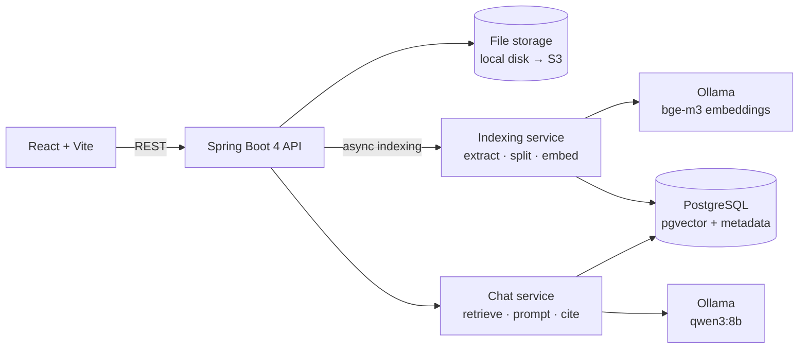

# CompanyBrain

**An AI knowledge assistant for internal company documents.**

Employees ask questions in plain English. CompanyBrain finds the answer in the company's own
documents and replies with a numbered citation for every fact. When the documents do not cover
the question, it says so instead of guessing.

> Example: an employee asks *"How many vacation days do I get in my first year?"*
> CompanyBrain retrieves the passage from the employee handbook, answers in one sentence,
> and links the answer to its source.

<!-- Add a screenshot or a short GIF of the demo here: docs/demo.gif -->

## Why this project

Most companies keep policies, guides and procedures in documents that people struggle to find,
and HR, IT and Finance spend hours answering the same questions. General-purpose chatbots do not
know internal policies and may invent them. CompanyBrain uses retrieval-augmented generation (RAG):

- **Semantic retrieval.** Documents are split into chunks and embedded (bge-m3), so a question
  matches the right passage even when it uses different words.
- **Grounded answers.** The model may only use the retrieved passages, must cite them as `[n]`, and
  replies with a fixed "not found" message when the documents do not cover the question.
- **Honest failure.** If no passage passes the similarity threshold, the API answers without calling
  the model at all, which avoids hallucinations and saves compute.

## Features (phase 1)

- Upload PDF, Word, Markdown and text files; indexing runs in the background (`202 Accepted`).
- Markdown and text files are split at their headings, then into chunks of about 300 tokens,
  so every citation names its section (for example *Vacation* or *Client meals*).
- PDF answers cite page numbers.
- Prompt-injection guard: retrieved text is treated as reference material, never as instructions.
- Deleting a document removes its vectors, its file and its database record.

## Architecture



| Layer | Technology |
|---|---|
| Backend | Java 21, Spring Boot 4.1, Spring AI 2.0, Spring Data JPA, Flyway, virtual threads |
| AI | Ollama (qwen3:8b chat, bge-m3 embeddings) locally; Amazon Bedrock planned |
| Data | PostgreSQL 17 with pgvector (HNSW index, cosine distance) |
| Frontend | React 19, TypeScript, Vite |
| Infrastructure | Docker Compose |
| Testing | JUnit 5, AssertJ, Testcontainers (pgvector) |

## Getting started

### Prerequisites

- Java 21 (Maven is not needed: the backend ships with the Maven Wrapper, `./mvnw`)
- Node.js 20 or later
- Docker Desktop
- [Ollama](https://ollama.com) installed natively (it uses the Apple GPU on macOS)

### 1. Pull the models (about 6 GB, one time)

```bash
ollama pull qwen3:8b
ollama pull bge-m3
```

### 2. Start PostgreSQL

```bash
docker compose up -d
```

### 3. Run the backend

```bash
cd backend
./mvnw spring-boot:run
```

The API starts on `http://localhost:8080`. Flyway creates the `documents` table and Spring AI
creates the `vector_store` table on first start.

### 4. Run the frontend

```bash
cd frontend
npm install
npm run dev
```

Open `http://localhost:5173`.

### 5. Try the demo

Upload the three files in `sample-docs/` from the Library page, then ask:

| Question | Answered from |
|---|---|
| How many vacation days do I get in my first year? | `employee-handbook.md` |
| How do I connect to the VPN from home? | `it-guide.md` |
| What is the maximum I can expense for a client dinner? | `expense-policy.md` |
| What is the dress code? | Not covered: returns the "not found" message |

## API

| Method | Path | Description |
|---|---|---|
| `POST` | `/api/documents` | Upload a file (multipart field `file`). Returns `202` and the document record. |
| `GET` | `/api/documents` | List documents with their indexing status. |
| `GET` | `/api/documents/{id}` | Get one document. |
| `DELETE` | `/api/documents/{id}` | Delete the document, its file and its vectors. |
| `POST` | `/api/chat` | Ask a question: `{ "question": "..." }`. |

Errors follow RFC 9457 (`application/problem+json`).

## Running the tests

```bash
cd backend
./mvnw test
```

- Unit tests cover prompt building and citation parsing.
- `RagFlowIntegrationTest` starts the application against a real pgvector database in Docker
  (Testcontainers) and runs upload → background indexing → retrieval → answer → delete.
  The chat and embedding models are replaced by deterministic fakes, so the test needs Docker
  but not Ollama.

## Roadmap

- [x] **Phase 1** RAG with citations, document library, web UI
- [ ] **Phase 2** Authentication (JWT), departments and permission-aware retrieval; chat history in MongoDB
- [ ] **Phase 3** Event-driven ingestion: S3 upload triggers AWS Lambda, API Gateway, Kafka events, audit log
- [ ] **Phase 4** AI agent with tools (leave balance, IT tickets, room booking) and user confirmation for actions
- [ ] **Phase 5** Redis caching and rate limiting, knowledge-gap report, retrieval evaluation, AWS deployment with Bedrock

## Design decisions

- **Local models first.** Ollama keeps development free and private. Spring AI abstracts the model
  provider, so moving to Amazon Bedrock is a dependency and configuration change.
- **pgvector instead of a separate vector database.** One PostgreSQL instance holds both business
  data and embeddings, which keeps operations simple and allows SQL filters on metadata
  (needed for permission-aware retrieval in phase 2).
- **Fixed "not found" text.** The fallback answer is defined in code, not generated,
  so it is predictable and testable.
- **bge-m3 embeddings.** The demo is English only, but bge-m3 is multilingual, so French or other
  languages can be added later without re-choosing the model or its 1024-dimension vector column.
