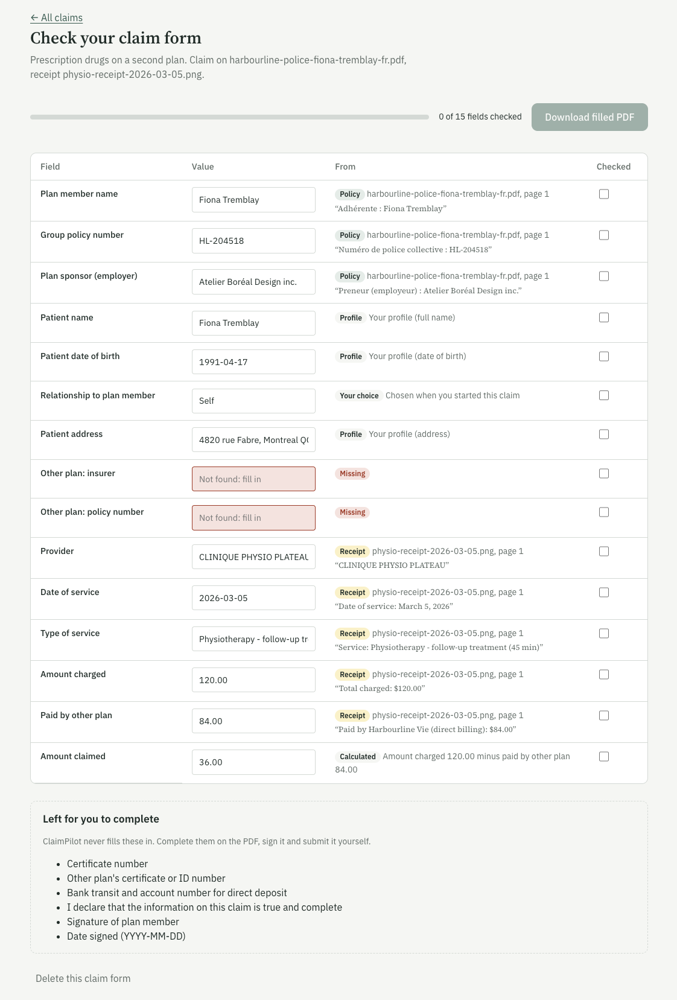
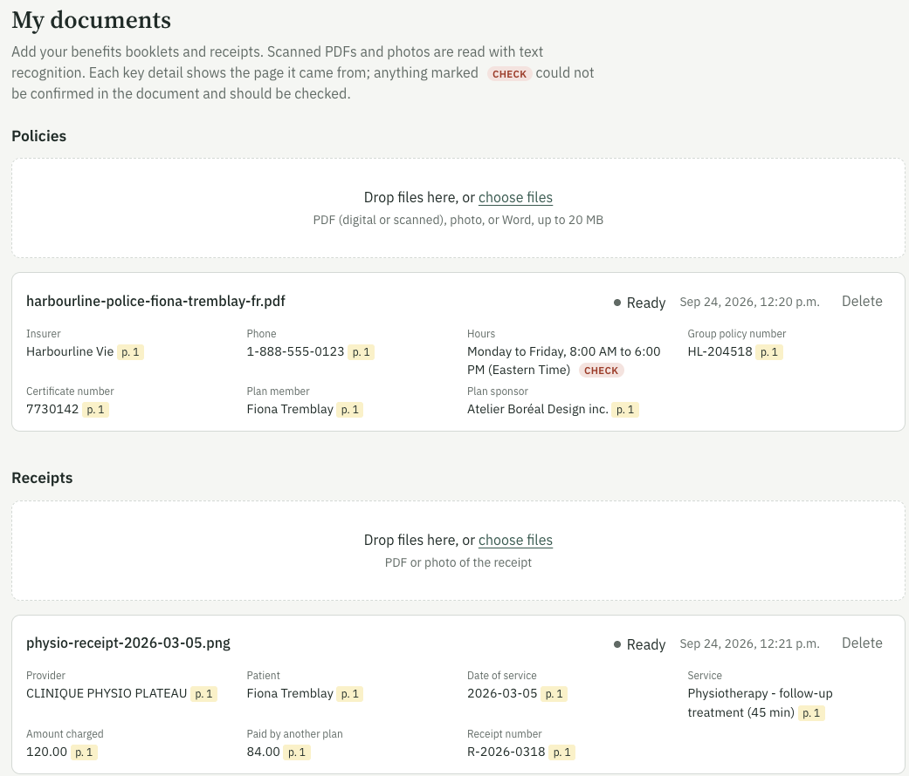
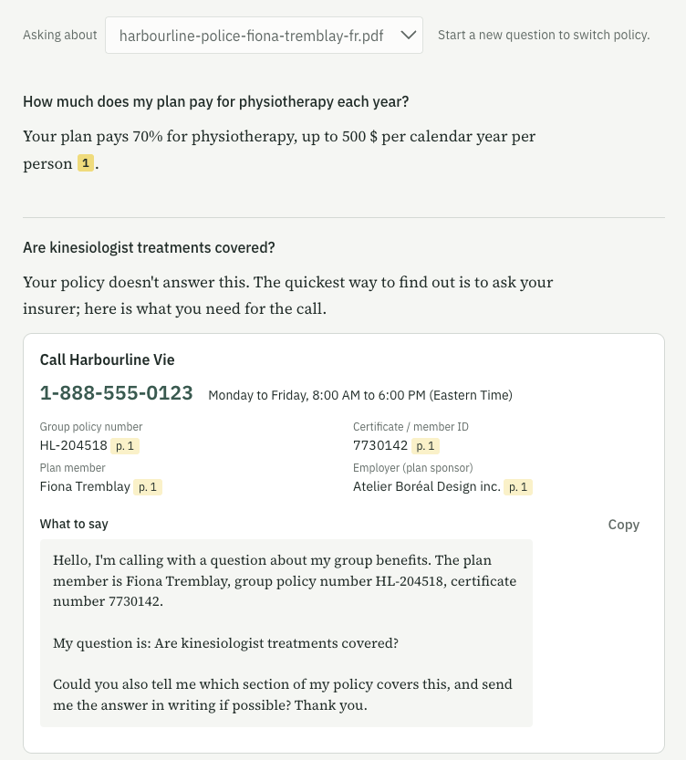
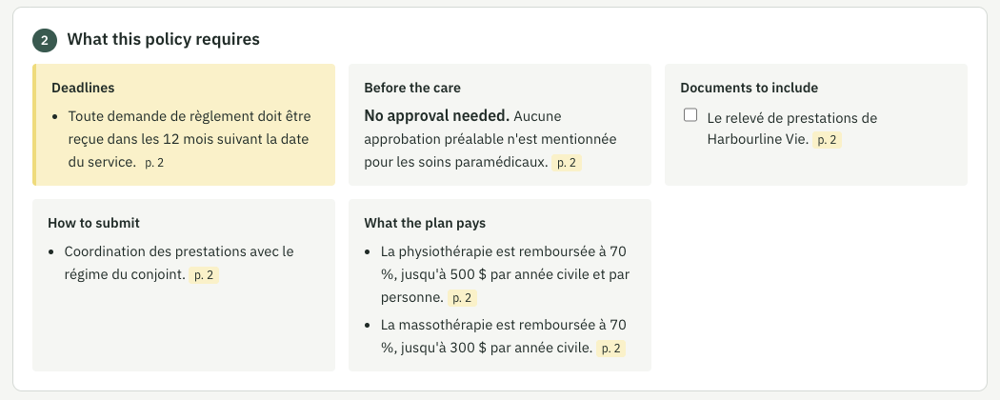
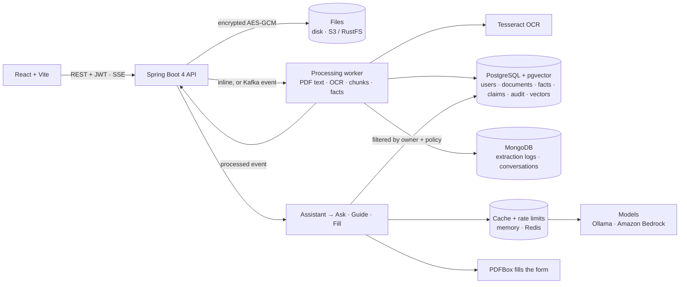

# ClaimPilot

**Ask your insurance policy, see what a claim needs, and get the claim form filled in from your own documents.**

Upload your group benefits booklet and ask questions in English, French or Chinese: every answer
comes from the policy and cites the page. If the policy is silent, ClaimPilot prepares the insurer's
number, your policy numbers and a script for the call. When you need to claim, it lists the
deadlines and documents *your* policy requires, then pre-fills the claim form from your policies,
your receipt and your profile, showing where every value came from. You check each field, sign and
submit the form yourself.

<p align="center">
  
</p>

## Why

- Half of Canadians do not know what insurance coverage they have, and 40–60% of workplace health
  benefits go unused each year, mostly because employees do not know what is covered.
- Clinics can bill the first plan directly, but a claim on a second plan (a spouse's group plan)
  usually has to be filled in and sent by hand.
- Complaints to the General Insurance OmbudService reached a record in 2024–2025, most about claims
  and how to read the policy.

Plain "upload a document and chat with it" is easy to copy. ClaimPilot's value is the whole loop
(*is it covered → how do I claim → the form is ready*) and the engineering around the AI that makes
the result trustworthy.

## What it does

### 1. Ask your policy
- Answers in the language of the question, even when the policy is in another language.
- Every fact cites the policy page; the Sources panel shows the clause text.
- Three outcomes:
  - **Answered**: the clauses answer the question.
  - **Unclear**: the relevant clauses are shown with a note to confirm with the insurer.
  - **Not in the policy**: a call kit with the insurer's phone and hours, your group policy and
    certificate numbers, and a script to read (in English, translated if you asked in French or
    Chinese). When nothing relevant is found, no model call is made at all.
- Follow-up questions keep the context of the conversation (stored in MongoDB).

### 2. Claim guide
For a claim type and a policy: deadlines, documents to include (a checklist), how to submit,
what the plan pays, and whether approval or a referral is needed first. Every item cites the
clause it came from; items the model cannot tie to a clause are dropped.

### 3. Pre-filled claim form
Fill a built-in form (a fictional English form from Cedarview, a French one from Harbourline) or
**upload your insurer's own fillable PDF**: its fields are read and matched by their labels, whatever
the language or field names. For a second-plan ("supplementary") health claim:

| Form section | Filled from |
|---|---|
| Plan member, policy and certificate numbers, employer | The plan being claimed on (the spouse's policy) |
| Other plan: insurer, policy and certificate numbers | The plan that paid first (your own policy) |
| Provider, date, service, receipt number, amount charged, amount paid by the other plan | The receipt (PDF or photo) |
| Patient name, date of birth, address, phone | Your profile |
| Relationship to the plan member | Chosen when you start the claim |
| Amount claimed | Calculated: charged minus paid by the other plan |
| Signature, declaration, date signed, bank details | **Never filled.** Left for you |

Each field shows its source (document, page and quote). Values the code could not confirm in the
document are flagged *check*. The filled PDF can only be downloaded once every field has been
checked, and it stays editable. Claim types: paramedical care, dental, prescription drugs, vision.

### Which plan pays first
With two plans in the family, ClaimPilot decides the order itself, in code, following the Canadian
(CLHIA) coordination of benefits guidelines: the patient's own plan pays first and the plan where they
are a dependent pays second; for a child, the plan of the parent whose birthday comes first in the year.
On the claim page, *Who is the claim for?* fills in the plan that paid first, the plan to claim the
balance on and the relationship, with the rule that decided it. Cases the rules do not settle (two plans
of one person, separated parents, missing birthdays) are shown as such, never guessed.

### 4. Assistant
Describe the situation once, in any language: *"My physio cost $120 and my plan paid $84, can I claim
the rest on my husband's plan?"* The assistant plans the steps (answer from the policy, show the claim
rules, pre-fill the form), asks back when something is ambiguous (*which plan?*), then runs the three
modules above in order, each with its own checks.

### Around the modules
- **Your data**: uploads are encrypted at rest (AES-256-GCM); every search and every file is scoped to
  the signed-in user; *Delete my data* removes everything, cached model replies included.
- **Live updates**: when a document finishes processing, the browser is told at once (Server-Sent
  Events) and a short message appears.
- **Activity**: sign-ins, uploads, processing results, claims and downloads are logged, and shown to
  the user under Profile. Values from documents are never written to the log.
- **Fair use**: requests that use the model are limited per user per minute, and sign-in attempts per
  address and per username (429 with Retry-After); identical prompts to the same model are answered
  from a cache. The web server sends a strict Content-Security-Policy and never leaks URLs as referrers.
- **Limits that protect the server**: at most two documents are processed at once per server (the
  rest wait their turn); each user can keep 100 files and 500 MB; the activity log keeps one year.
- **Deletion that cannot half-fail**: *Delete my data* locks the account first, then removes
  everything; if a step is interrupted, a background job finishes it within minutes.
- **Safe defaults**: the development keys in this repository are refused when
  `claimpilot.security.allow-dev-secrets` is false (the `aws` profile). With Kafka's at-least-once
  delivery, processing the same upload twice changes nothing.

## Walkthrough

These screenshots come from a local run with the fictional sample documents: Fiona's own plan
(a French policy, Harbourline Vie) and a photo of a physiotherapy receipt.

### 1. Upload: the key details are read and checked



1. The file is stored and processed in the background, so the upload returns at once and the card
   switches from *Processing* to *Ready*.
2. Text is read page by page with PDFBox. A page with almost no text (a scan) or a photo goes through
   Tesseract OCR instead, so the receipt above was read from a PNG.
3. The model is asked for each key detail **and the exact quote it came from**.
4. Code then searches for that quote in the page text, records the page, and checks the value really
   appears in the quote (dates and amounts are parsed in English and French). Every detail shows its
   page (`p. 1`). In this run the model returned the office hours translated into English; that text is
   not in the French policy, so the code could not confirm it and marked it **CHECK** instead of
   trusting it.

### 2. Ask: answered with a page, or a call kit



1. The question is embedded (bge-m3) and searched in pgvector, **filtered to this user and this
   policy**. Because bge-m3 is multilingual, an English question finds the French clause.
2. The best clauses go to the model with their page numbers, and it must reply with a status:
   answered, unclear or not in the policy.
3. *How much does my plan pay for physiotherapy?* is answered in English from the French text and
   cites the clause (`1` opens it in the Sources panel: page 2).
4. *Are kinesiologist treatments covered?* The Harbourline policy never mentions it, so instead of a
   guess the reply is a **call kit**: the insurer's number and hours, the policy and certificate
   numbers (each with its page) and a script to read. An answer marked "answered" without a citation
   would be downgraded by code to "unclear".

### 3. Claim guide: what this policy requires



For the chosen claim type the policy is searched with a few fixed queries (deadlines, documents,
submission, coverage, prior approval) and the model sorts what it finds into these boxes. Each item
keeps the policy's own words and page; an item that does not point to a real clause is dropped by
code. Deadlines are highlighted because missing one loses the claim. The guide is cached per policy
and claim type.

### 4. The pre-filled claim form

Shown at the top of this page. When the claim is started:

1. **Field mapping.** The PDF form's fields have meaningless names (`txtField_07`). The model maps
   each field's label to a known data item once; the mapping is saved per form version (SHA-256) and
   reused, so later claims make no model call for it.
2. **Values.** Each item is taken from one source, and the source is shown next to it:
   - **Policy**: plan member, policy number and employer, with the quote and page;
   - **Profile**: patient name, date of birth, address;
   - **Receipt**: provider, date, service, amounts, with the quote read from the photo;
   - **Your choice**: the relationship picked when the claim was started;
   - **Calculated**: amount claimed = 120.00 charged − 84.00 paid by the other plan = **36.00**.
3. **Missing** values are shown in red rather than invented. Here no first-paying plan was selected,
   so the other plan's insurer and policy number are left to fill in.
4. **Left for you to complete.** Signature, declaration, date signed and bank details are never
   filled, even if the model maps a field to them: code forces them blank. (The two certificate numbers
   in this list were caught by that rule by mistake when the screenshot was taken; it has been fixed
   and they are now filled from the policies.)
5. **Review.** *Download filled PDF* stays disabled until every field is checked (0 of 15 here). PDFBox
   then writes the values into the form, which stays editable; the member signs and sends it.

## How the AI is kept honest

- **The model reads, the code checks.** When a document is uploaded, the model extracts key facts
  (policy number, phone, amounts, dates) together with the exact quote each one came from. Code then
  looks for that quote in the document text, finds its page, and confirms the value is inside the
  quote, parsing dates and amounts in English and French formats. Anything it cannot confirm is
  marked unverified instead of being trusted.
- **The model maps, the code fills.** PDF field names are often meaningless (`txtField_07`). The model
  reads each field's label once and maps it to a known data item; the mapping is stored per form
  version (SHA-256) and reused, so later claims need no model call. Apache PDFBox writes the values,
  which is deterministic and unit-tested.
- **Hard rules in code, not in the prompt.** Signature, declaration and consent fields are forced to
  stay blank even if the model maps them to a value (a test checks exactly that). An "answered"
  reply that cites nothing is downgraded to "unclear", and so is one that rests on a discretionary
  clause ("may be considered", "at the insurer's discretion"). Guide items without a valid clause
  are dropped.
- **Data isolation.** Every chunk in pgvector carries its owner's id, and every search is filtered
  by the signed-in user and the chosen policy, so another person's policy text never reaches the model.
- **Prompt-injection guard.** Document text is passed as data, with instructions to ignore any
  instructions inside it.
- **The model plans, the code decides.** The assistant's plan is one JSON reply. Code drops unknown
  actions and invented document numbers, always shows the claim rules before a form, fills in what it
  can work out itself (the plan that paid first is the one naming the member; the kind of care comes
  from the receipt; the relationship from the plan member's name), and asks the member when something
  is still ambiguous (which plan, which kind of care, who received the care). The model never calls a
  service directly.

## Architecture



Everything beyond PostgreSQL and MongoDB is optional and switched on by a Spring profile, so the app
runs on a laptop with two containers and scales out without code changes:

| Profile | What changes | Needs |
|---|---|---|
| *(default)* | Files on disk, processing on a background thread, cache in memory, Ollama | `docker compose up -d` |
| `events` | Files in an S3 bucket; uploads and results travel as Kafka events to a separate worker | `docker compose --profile events up -d` (Kafka, RustFS) |
| `sqs` | The AWS design: each stored file sends an S3 "object created" notification through an SQS queue to the worker | `docker compose --profile events --profile sqs up -d` (RustFS, ElasticMQ) |
| `cache` | Model replies and rate limits shared across servers in Redis | `docker compose --profile cache up -d` |
| `aws` | Amazon Bedrock (Claude, Titan embeddings), Amazon S3, RDS; secrets from the environment | an AWS account, see [docs/deploy-aws.md](docs/deploy-aws.md) (paid) |

| Layer | Technology |
|---|---|
| Backend | Java 21, Spring Boot 4.1, Spring AI 2.0, Spring Security (JWT), Spring Data JPA, MongoDB and Redis, Spring Kafka, Flyway, virtual threads |
| AI | Ollama locally: qwen3:8b (answers, extraction, mapping, planning), bge-m3 (multilingual embeddings). Amazon Bedrock with the `aws` profile |
| Documents | Apache PDFBox (read pages, fill forms), Tesseract OCR (photos, scanned PDF pages), Apache Tika (Word) |
| Data | PostgreSQL 17 + pgvector (HNSW, cosine); MongoDB 7; S3-compatible storage (AWS SDK v2); Redis 7; Kafka 3.9 |
| Frontend | React 19, TypeScript, Vite; Server-Sent Events for notifications |
| Delivery | Dockerfiles for backend and frontend, `docker compose --profile app` for the whole stack |
| Testing | JUnit 5, AssertJ, MockMvc, Testcontainers (pgvector, MongoDB, Kafka, Redis, RustFS) |

## Getting started

### Prerequisites

- Java 21 (Maven is not needed: the backend ships with the Maven Wrapper, `./mvnw`)
- Node.js 20 or later
- Docker Desktop
- [Ollama](https://ollama.com) installed natively (it uses the Apple GPU on macOS)
- Tesseract for photos and scanned PDFs: `brew install tesseract` (add `tesseract-lang` for French
  scans, then set `claimpilot.ocr.languages: eng+fra`)

### Run

```bash
ollama pull qwen3:8b
ollama pull bge-m3

docker compose up -d            # PostgreSQL and MongoDB

cd backend && ./mvnw spring-boot:run
# in another terminal
cd frontend && npm install && npm run dev
```

Open `http://localhost:5173` and sign in as **fiona** (password `demo1234`); her profile is already
filled in. **sam** is an empty account. Outside local development, set
`CLAIMPILOT_SECURITY_JWT_SECRET` to a random string of at least 32 characters and
`CLAIMPILOT_STORAGE_ENCRYPTION_KEY` to `openssl rand -base64 32`.

With Kafka, S3 storage and Redis (all free, in Docker):

```bash
docker compose --profile events --profile cache up -d
cd backend && SPRING_PROFILES_ACTIVE=events,cache ./mvnw spring-boot:run
```

Or the whole app in Docker (Ollama still native): `docker compose --profile app up -d --build`, then
open `http://localhost:3000`.

### Demo (1–2 minutes)

The files are in `sample-docs/`. All companies and people are fictional.

1. **My documents**: upload `cedarview-policy-marc-gagnon.pdf` (Fiona's husband's plan, or the
   `-scanned` version to show OCR) and `harbourline-police-fiona-tremblay-fr.pdf` (Fiona's own plan,
   in French). Each shows the key details read from it, with page numbers.
2. **Ask** about the Cedarview policy:
   - *How much does my plan pay for physiotherapy each year?* → answered, cites page 2.
   - *Are kinesiologist treatments covered?* → the policy only says they "may be considered", so this
     is typically marked unclear and shows the clause.
   - *我的保险报销针灸吗？* (acupuncture is not in the policy) → a reply in Chinese with a call kit and an
     English script.
3. **Claim**: under *Who is the claim for?* choose *Me*: ClaimPilot applies the coordination of benefits
   rules and fills in claim on Cedarview, paid first by Harbourline. Choose *Paramedical care*. The guide shows
   the 12-month deadline and the documents to send. Upload `physio-receipt-2026-03-05.png`.
4. **Fill in the claim form**: every field shows its source; the amount claimed is $120.00 − $84.00 =
   $36.00. Check each field, then download the PDF. Signature and declaration are blank. To try your
   insurer's own form, add `harbourline-demande-de-remboursement.pdf` under *Claim forms* and choose it.
5. **Assistant**: *My physio cost $120 and my own plan paid $84. Can I claim the rest on my husband's
   plan?* It asks which plan to claim on, then shows the claim rules and a pre-filled form.

The sample documents are generated by `backend/src/test/java/com/claimpilot/samples/SampleDocuments.java`.

## API

All endpoints except sign-in and sign-up need `Authorization: Bearer <token>`. Every resource is
scoped to the signed-in user; another user's ids return 404.

| Method | Path | Description |
|---|---|---|
| `POST` | `/api/auth/login`, `/api/auth/register` | Sign in or sign up → token and user. |
| `GET` | `/api/auth/me` | The signed-in user. |
| `GET` / `PUT` | `/api/profile` | Name, date of birth, address, phone. |
| `DELETE` | `/api/account` | Delete the account and all its data. |
| `POST` / `GET` | `/api/policies` | Upload (multipart `file`, returns `202`) or list policies with their key facts. |
| `GET` / `DELETE` | `/api/policies/{id}` | One policy; delete it with its chunks and facts. |
| `POST` / `GET` / `DELETE` | `/api/receipts`, `/api/receipts/{id}` | Same for receipts. |
| `POST` | `/api/chat` | `{ question, policyId, conversationId? }` → answer, status, language, citations, call kit. |
| `GET` / `DELETE` | `/api/conversations`, `/api/conversations/{id}` | Conversation history. |
| `GET` | `/api/claims/types` | Supported claim types. |
| `GET` | `/api/claims/guide?policyId=&type=` | Deadlines, documents, submission, coverage, pre-approval. |
| `POST` / `GET` | `/api/claims` | Start a pre-filled claim `{ claimType, policyId, otherPolicyId?, receiptId?, relationship }`, or list claims. |
| `GET` / `DELETE` | `/api/claims/{id}` | One claim with its fields and sources. |
| `PATCH` | `/api/claims/{id}/fields/{key}` | `{ value?, reviewed? }`: correct a value or mark it checked. |
| `GET` | `/api/claims/{id}/pdf` | The filled PDF, once every field is checked. |
| `GET` / `POST` / `DELETE` | `/api/forms`, `/api/forms/{id}` | Built-in claim forms and your uploaded fillable PDFs (`formKey` in `POST /api/claims`). |
| `POST` | `/api/assistant` | `{ message, policyId?, claimType? }` → plan, steps (answer, guide, claim, question back), summary. |
| `GET` | `/api/notifications` | Recent notifications. |
| `POST` / `GET` | `/api/notifications/ticket`, `/api/notifications/stream?access_token=` | A one-minute ticket, then the live stream (Server-Sent Events). The ticket opens nothing else, and a session token is never accepted in a URL. |
| `GET` | `/api/audit` | Your activity log, newest first. |
| `GET` | `/api/claims/coordination?patient=ME\|SPOUSE\|CHILD` | Which plan pays first and which to claim the balance on, with the rule applied. |

Errors follow RFC 9457 (`application/problem+json`). Requests that use the model are limited per user
(default 20 per minute), and sign-in and sign-up per client address and per username (default 10 per
minute); beyond that the answer is `429` with `Retry-After`.

## Tests

```bash
cd backend
./mvnw test
```

- **Unit tests**: date and amount parsing (English and French), quote verification, extraction
  parsing, language detection, answer status parsing, call script, guide parsing, field mapping
  rules, value assembly, PDF filling, file encryption, the assistant's plan rules, cache and rate
  limits (in memory and in a real Redis).
- **Integration tests** run the whole application over HTTP against real PostgreSQL/pgvector and
  MongoDB in Docker (Testcontainers), with deterministic fake models:
  - `PolicyIntegrationTest`: verified facts, cited answers, unclear and not-in-policy answers,
    French question with an English call script, follow-ups.
  - `ClaimIntegrationTest`: guide with cited items and caching, the complete pre-fill → review →
    download flow, mapping cache, and isolation between users.
  - `ScannedDocumentIntegrationTest`: OCR of a scanned PDF and a receipt photo (skipped without Tesseract).
  - `AccountIntegrationTest`: sign-in, sign-up, profile, account deletion across both databases, the
    notification stream's token rule, and the activity log.
  - `FormIntegrationTest`: a claim filled on an uploaded French form, a PDF without fields rejected,
    another user's form refused.
  - `EventDrivenIntegrationTest`: with real Kafka and an S3 server, an upload is stored encrypted,
    processed by the worker and comes back as a notification.
  - `AssistantIntegrationTest`: a question back, then guide and pre-filled form from one message; a
    claim planned on the plan that pays first is moved to the plan that pays second.
  - `SqsIntegrationTest`: with a real SQS-compatible queue, an upload is processed from its S3-style
    "object created" notification.

### Accuracy evaluation

`backend/src/test/resources/eval/cases.json` holds 29 questions (English, French, Chinese; answered,
unclear and not-in-policy cases) and 18 facts to extract from four fictional documents, including a
five-page booklet laid out like real ones (definitions, a coverage table, dental waiting periods,
exclusions). To measure ClaimPilot on **your own real policies** without committing them, add them
with their questions under `sample-docs/private/eval/`: see [docs/evaluation.md](docs/evaluation.md).
With Ollama running:

```bash
cd backend
./mvnw test -Peval
```

It runs the real models and writes `target/eval-report.md`: answer status accuracy, cited page,
expected content, facts extracted, average answer time. It is not part of the normal build; the
**Accuracy evaluation** workflow runs it on GitHub Actions (Ollama on the runner's CPU) weekly and on
demand.

Latest result (qwen3:8b, bge-m3, CPU runner):

| Metric | Result |
|---|---|
| Answer status (answered / unclear / not in policy) | 16 / 17 (94%) |
| Cited the expected page | 14 / 14 (100%) |
| Answer contains the expected facts | 17 / 17 (100%) |
| Key facts extracted correctly | 13 / 13 (100%) |

The remaining miss: asked whether a $900 dental plan needs a predetermination (the policy requires one
over $500), the model answers "unclear" instead of applying the threshold. It errs on the cautious
side, and the answer still cites the right clause.

## Principles

1. ClaimPilot never signs or submits a claim. Declarations have legal weight; the member checks every
   field and signs.
2. It never logs in to insurer websites.
3. It does not collect a social insurance number; bank details are left for the member.
4. It explains what the policy says; it does not give insurance or legal advice.
5. The public repository contains only fictional policies, receipts and forms.

## Roadmap

- [x] **Phase 1**: ask the policy (three outcomes, call kit), claim guide, pre-filled second-plan
  claim form with sources, OCR, accounts and data isolation.
- [x] **Phase 2**: vision claims; built-in English and French forms and the user's own fillable PDFs;
  files encrypted at rest.
- [x] **Phase 3**: event-driven processing with S3 storage and Kafka (a worker in place of an
  S3-triggered Lambda), live notifications, activity log.
- [x] **Phase 4**: assistant that plans from one message and chains answer, claim rules and form filling.
- [x] **Phase 5**: model reply cache and per-user rate limits (memory or Redis), accuracy evaluation
  set, Bedrock profile, Dockerfiles and an AWS deployment guide (not deployed: it is paid).
- [x] **Next**: evaluation on a booklet laid out like real ones and on the member's own private
  policies; S3 events through SQS (the AWS design, ElasticMQ locally); coordination-of-benefits rules
  that decide which plan pays first.
- [ ] **Later**: separated-parents (custody) rules; more insurers' claim forms out of the box.
