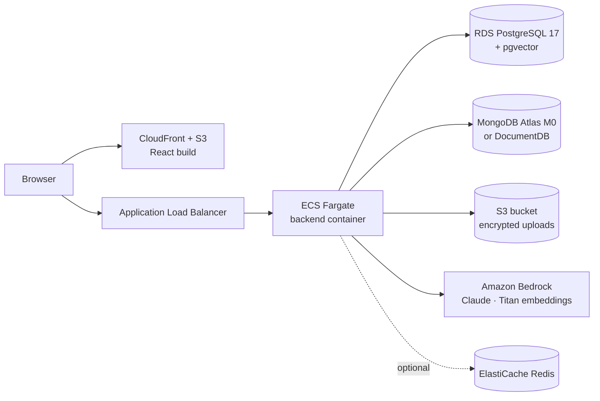

# Deploying ClaimPilot on AWS

> **Nothing described here has been created.** Every AWS service below is billed. Check the
> estimate, then create resources only when you decide to, and delete them after a demo.

The application is ready for AWS through configuration only: the `aws` Spring profile
(`backend/src/main/resources/application-aws.yml`) switches the models to Amazon Bedrock and storage
to Amazon S3, and reads every secret from environment variables.

## Target architecture



| Local (free) | AWS |
|---|---|
| Ollama qwen3:8b | Bedrock Converse with a Claude model (`CLAIMPILOT_BEDROCK_CHAT_MODEL`) |
| Ollama bge-m3 (1024 dims) | Bedrock Titan Text Embeddings v2 (1024 dims: same database schema) |
| Folder or RustFS | S3 bucket, files still AES-GCM encrypted by the app (plus S3 SSE) |
| Postgres + pgvector in Docker | RDS for PostgreSQL 17 (pgvector is available on RDS) |
| MongoDB in Docker | MongoDB Atlas free M0 cluster, or Amazon DocumentDB |
| Kafka in Docker | Keep `events.mode=inline` (see below), or Amazon MSK |
| Redis in Docker | ElastiCache for Redis, only when running more than one backend task |

**Kafka on AWS.** Amazon MSK has no free tier and even MSK Serverless costs hundreds of dollars a month,
far too much for a demo. With one backend task, inline mode is enough. At real scale, the planned path
is S3 event notifications to SQS, with the existing worker consuming the queue (the role a Lambda
would play), or MSK if the event stream is shared with other systems.

## Rough monthly cost (ca-central-1, always on)

| Service | Size | Approx. USD / month |
|---|---|---|
| ECS Fargate | 1 task, 1 vCPU, 2 GB | 40 |
| Application Load Balancer | 1 | 20 |
| RDS PostgreSQL | db.t4g.micro, 20 GB | 17 (free for 12 months on a new account) |
| MongoDB Atlas | M0 | 0 |
| S3 + CloudFront | a few GB | 1 |
| Bedrock | about 1,000 questions (Claude Haiku class model + Titan) | 2 to 5 |
| ElastiCache Redis | optional, cache.t4g.micro | 12 |
| **Total** | | **about 80 to 95** |

These are estimates; confirm with the [AWS Pricing Calculator](https://calculator.aws/). Scaling the
ECS service to 0 tasks and stopping RDS between demos brings the cost close to zero.

## Steps (when you decide to deploy)

1. **Bedrock**: in the Bedrock console, enable access to a Claude model and to Titan Text
   Embeddings v2 in your region; note the model or inference profile id.
2. **Data**: create the RDS PostgreSQL 17 instance and an Atlas M0 cluster. Flyway creates the tables
   and Spring AI creates the `vector` extension and index on first start.
3. **Storage**: create a private S3 bucket with Block Public Access and default encryption.
4. **Secrets** in AWS Secrets Manager, passed to the task as environment variables:
   `CLAIMPILOT_DB_URL`, `CLAIMPILOT_DB_USER`, `CLAIMPILOT_DB_PASSWORD`, `CLAIMPILOT_MONGODB_URI`,
   `CLAIMPILOT_S3_BUCKET`, `CLAIMPILOT_STORAGE_ENCRYPTION_KEY` (`openssl rand -base64 32`),
   `CLAIMPILOT_SECURITY_JWT_SECRET` (32+ characters), `CLAIMPILOT_BEDROCK_CHAT_MODEL`,
   and `SPRING_PROFILES_ACTIVE=aws`.
5. **Images**: build `backend/Dockerfile`, push it to ECR; build the frontend with `npm run build`
   and upload `frontend/dist` to an S3 bucket behind CloudFront (or run `frontend/Dockerfile`).
6. **ECS**: a Fargate service behind the ALB, health check on `/actuator/health`, with a task role
   limited to what the app needs:

```json
{
  "Version": "2012-10-17",
  "Statement": [
    {
      "Effect": "Allow",
      "Action": ["s3:GetObject", "s3:PutObject", "s3:DeleteObject", "s3:ListBucket"],
      "Resource": ["arn:aws:s3:::YOUR-BUCKET", "arn:aws:s3:::YOUR-BUCKET/*"]
    },
    {
      "Effect": "Allow",
      "Action": ["bedrock:InvokeModel", "bedrock:InvokeModelWithResponseStream"],
      "Resource": "*"
    }
  ]
}
```

7. **Clean up** after the demo: scale the service to 0 or delete the stack, delete the RDS instance
   (take a snapshot if needed) and empty the bucket.
